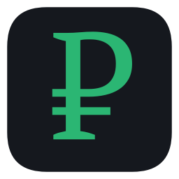

<div align="center">



# ru-finance

**MCP-сервер с данными Московской биржи и Банка России плюс доменная аналитика облигаций и портфеля.**


</div>

Подключается к Claude (Desktop / Code) и любым MCP-клиентам — локально через stdio или как remote-сервис по HTTP. Даёт котировки, метрики облигаций, ставки ЦБ, ожидания по ставке из G-кривой ОФЗ и готовые отчёты по портфелю.

> [!NOTE]
> Сервер **generic и не хранит личных данных** — бумаги и портфель передаются параметрами, его можно безопасно хостить и делиться. Он отдаёт **числа**; интерпретация остаётся за агентом (см. [AGENTS.md](AGENTS.md)). Данные с задержкой ~15 мин; это не инвестиционная рекомендация.

## Возможности

- **MOEX** — котировки, история, свечи, дивиденды; запасной доступ к любому из ~252 эндпоинтов ISS.
- **Облигации** — цена, YTM, дюрация (Маколея и модифицированная), сценарии дохода при сдвиге ставки, реальная доходность.
- **Банк России** — ключевая ставка, RUONIA (+ срочная кривая), MIACR, курсы валют, драгметаллы, ЗВР.
- **Ожидания по ставке** — сигналы из G-кривой ОФЗ (наклон, спреды, форварды, метка `cuts/hikes/flat`) и точная NSS-модель MOEX для доходности на любом сроке.
- **Портфель** — снимок (стоимость, P&L, распределение, дюрация, денежный поток), what-if по ставке, календарь выплат, лидеры/аутсайдеры.

Всего 22 инструмента — полный справочник в **[docs/TOOLS.md](docs/TOOLS.md)**.

## Быстрый старт

Требуется **Python 3.11+** и сетевой доступ к `iss.moex.com` и `cbr.ru`.

```bash
git clone https://github.com/diekinari/ru-finance-mcp.git
cd ru-finance-mcp
python3 -m venv .venv && source .venv/bin/activate
pip install -e .
python -m ru_finance.mcp_server        # запуск (stdio)
```

### Подключение из Claude

```bash
# Claude Code — локально
claude mcp add ru-finance -- /путь/.venv/bin/python -m ru_finance.mcp_server
```

Claude Desktop — добавьте в `claude_desktop_config.json`:

```json
{
  "mcpServers": {
    "ru-finance": {
      "command": "/путь/.venv/bin/python",
      "args": ["-m", "ru_finance.mcp_server"]
    }
  }
}
```

## Remote-режим (HTTP)

Чтобы подключаться по URL (например, за nginx с TLS):

```bash
MCP_TRANSPORT=streamable-http MCP_HOST=127.0.0.1 MCP_PORT=8000 \
  python -m ru_finance.mcp_server
# эндпоинт: http://127.0.0.1:8000/mcp
```

```bash
claude mcp add --transport http ru-finance https://<домен>/mcp
```

> [!IMPORTANT]
> Хост должен иметь сетевой доступ к `iss.moex.com` и `cbr.ru`. Публичный URL стоит защитить токеном авторизации. Полный гайд по деплою (systemd + nginx + TLS + токен) — готовится в `docs/DEPLOY.md`.

## Документация

| Файл | Назначение |
|---|---|
| [docs/TOOLS.md](docs/TOOLS.md) | Полный справочник инструментов: входы, выходы, примеры |
| [AGENTS.md](AGENTS.md) | Как ИИ-ассистенту правильно пользоваться сервером |


## Как устроено

| Слой | Назначение |
|---|---|
| `moex` (aioboy) | транспорт и парсинг ISS Московской биржи |
| `cbrapi` | данные веб-сервисов Банка России |
| `ru_finance/` | доменный слой: резолв бумаг, нормализация, облигационная математика, G-кривая, отчёты по портфелю |
| FastMCP | публикация инструментов по stdio / streamable-http |

> [!WARNING]
> Образовательный инструмент. Данные бесплатные, с задержкой, возможны пропуски и ошибки. Не является индивидуальной инвестиционной рекомендацией — решения принимаете вы.
